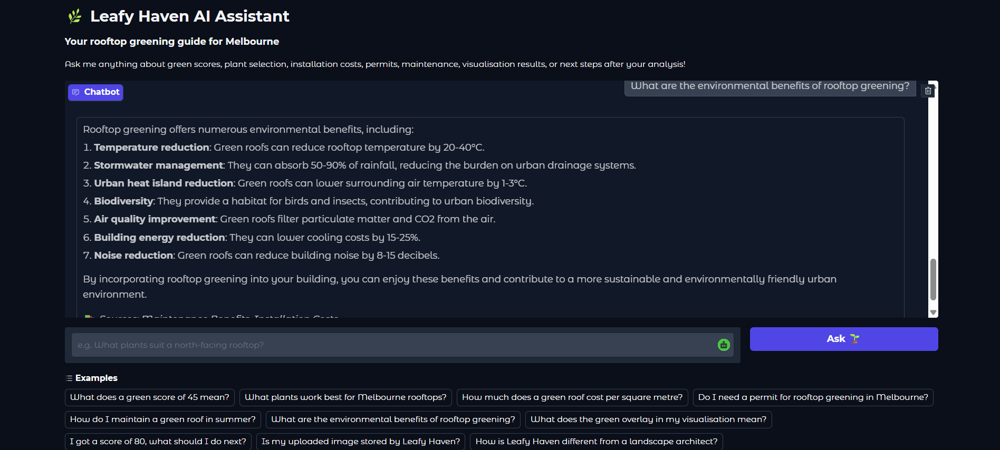

# Leafy-Haven-rag
RAG-powered Q&amp;A assistant for the Leafy Haven rooftop greening app - built with LangChain, ChromaDB, HuggingFace and Groq
# 🌿 Leafy Haven RAG Assistant

A Retrieval-Augmented Generation (RAG) powered Q&A assistant built as an extension of the [Leafy Haven](https://github.com/Ratch03/Leafy-Haven-AI) rooftop greening application for Melbourne, Australia.

Leafy Haven uses computer vision to analyse rooftops and generate green scores — this project adds an intelligent assistant layer so users can ask natural language questions and get accurate, document-grounded answers about their rooftop greening journey.

---

## What it does

Users can ask questions like:
- *"My rooftop scored 45, what does that mean?"*
- *"What plants work best for a north-facing Melbourne rooftop?"*
- *"How much does a green roof cost per square metre?"*
- *"Do I need a council permit for rooftop greening?"*
- *"What does the green overlay in my visualisation mean?"*
- *"I got a score of 80, what should I do next?"*

The system retrieves the most relevant information from a curated knowledge base and generates accurate, grounded answers — with source citations on every response.

---

## Architecture

| Step | Component | Detail |
|---|---|---|
| 1 | User submits question | Via Gradio chat interface |
| 2 | HuggingFace Embeddings | `sentence-transformers/all-MiniLM-L6-v2` converts question to vector |
| 3 | ChromaDB Vector Store | Semantic similarity search retrieves top 3 relevant chunks |
| 4 | LangChain RetrievalQA | Stuffs retrieved chunks into prompt template |
| 5 | Groq LLM (Llama 3.1) | Generates grounded answer with source citations |
| 6 | Gradio Interface | Displays answer and sources to user |

---

## Knowledge Base

The RAG system is grounded in 8 curated documents covering:

| Document | Topics Covered |
|---|---|
| `plant_selection.txt` | Suitable plants for Melbourne rooftops, native species, plants to avoid |
| `installation_costs.txt` | Extensive, intensive and semi-intensive roof types, costs per m² |
| `permits_regulations.txt` | City of Melbourne permits, building approvals, heritage overlays, grants |
| `green_score_explained.txt` | How the Leafy Haven green score is calculated and interpreted |
| `maintenance_benefits.txt` | Seasonal maintenance schedule, environmental benefits, water usage |
| `visualisation_guide.txt` | How to interpret the Stable Diffusion visualisation output |
| `next_steps.txt` | Recommended actions by score range, professional contacts |
| `faq.txt` | Common user questions about the Leafy Haven application |

---

## Tech Stack

- **Embeddings:** `sentence-transformers/all-MiniLM-L6-v2` via HuggingFace
- **Vector Store:** ChromaDB (local)
- **LLM:** Llama 3.1 8B via Groq API (free tier)
- **Orchestration:** LangChain RetrievalQA chain
- **Chunking:** RecursiveCharacterTextSplitter (chunk size 500, overlap 50)
- **Interface:** Gradio with source citation display
- **Environment:** Google Colab

---

## How to Run

1. Open `leafy_haven_rag.ipynb` in Google Colab
2. Get a free API key from [groq.com](https://groq.com)
3. Run cells in order — the notebook is fully documented
4. A Gradio live link will be generated — open it in any browser

---

## Demo

---

## Related Project

This project extends [Leafy Haven AI](https://github.com/Ratch03/Leafy-Haven-AI) — a computer vision pipeline that segments rooftops, estimates depth, detects vegetation, generates green visualisations using Stable Diffusion, and scores rooftops for greening potential.

Built for the City of Melbourne sustainability challenge as part of Monash University's Industry Experience Studio.

---

## 👩‍💻 Author

**Ratchana Pourouchottaman**  
Master of AI — Monash University  
[LinkedIn](https://linkedin.com/in/ratchana) · [GitHub](https://github.com/Ratch03) · [Portfolio](https://portfolio-beige-mu-mc6c9uw8zf.vercel.app)
